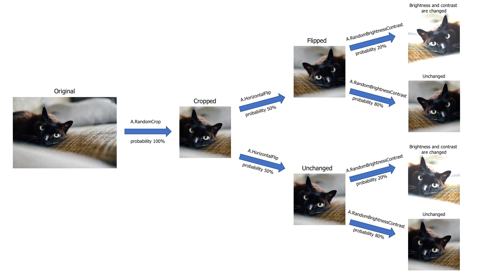

# Image augmentation for classification

We can divide the process of image augmentation into four steps:

1. Import albumentations and a library to read images from the disk (e.g., OpenCV).
2. Define an augmentation pipeline.
3. Read images from the disk.
4. Pass images to the augmentation pipeline and receive augmented images.

## Step 1. Import the required libraries.

- Import Albumentations

```python
import albumentations as A
```

- Import a library to read images from the disk. In this example, we will use [OpenCV](https://opencv.org/). It is an open-source computer vision library that supports many image formats. Albumentations has OpenCV as a dependency, so you already have OpenCV installed.

```python
import cv2
```

## Step 2. Define an augmentation pipeline.

To define an augmentation pipeline, you need to create an instance of the `Compose` class. As an argument to the `Compose` class, you need to pass a list of augmentations you want to apply. A call to `Compose` will return a transform function that will perform image augmentation.

 Let's look at an example:

```python
transform = A.Compose([
    A.RandomCrop(width=256, height=256),
    A.HorizontalFlip(p=0.5),
    A.RandomBrightnessContrast(p=0.2),
])

```

In the example, `Compose` receives a list with three augmentations: `A.RandomCrop`, `A.HorizontalFlip`, and `A.RandomBrighntessContrast`. You can find the full list of all available augmentations [in the GitHub repository](https://github.com/albumentations-team/albumentations#pixel-level-transforms) and [in the API Docs](https://albumentations.ai/docs/api_reference/augmentations/). A demo playground that demonstrates how augmentations will transform the input image is available at [https://explore.albumentations.ai](https://explore.albumentations.ai).

To create an augmentation, you create an instance of the required augmentation class and pass augmentation parameters to it. `A.RandomCrop` receives two parameters, `height` and `width`. `A.RandomCrop(width=256, height=256)` means that `A.RandomCrop` will take an input image, extract a random patch with size 256 by 256 pixels from it and then pass the result to the next augmentation in the pipeline (in this case to `A.HorizontalFlip`).

`A.HorizontalFlip` in this example has one parameter named `p`. `p` is a special parameter that is supported by almost all augmentations. It controls the probability of applying the augmentation. `p=0.5` means that with a probability of 50%, the transform will flip the image horizontally, and with a probability of 50%, the transform won't modify the input image.

`A.RandomBrighntessContrast` in the example also has one parameter, `p`. With a probability of 20%, this augmentation will change the brightness and contrast of the image received from `A.HorizontalFlip`. And with a probability of 80%, it will keep the received image unchanged.


**A visualized version of the augmentation pipeline. You pass an image to it, the image goes through all transformations, and then you receive an augmented image from the pipeline.**


## Step 3. Read images from the disk.

To pass an image to the augmentation pipeline, you need to read it from the disk. The pipeline expects to receive an image in the form of a NumPy array. If it is a color image, it should have three channels in the following order: Red, Green, Blue (so a regular RGB image).

To read images from the disk, you can use [OpenCV](https://opencv.org/) - a popular library for image processing. It supports a lot of input formats and is installed along with Albumentations since Albumentations utilizes that library under the hood for a lot of augmentations.

To import OpenCV

```python
import cv2
```

To read an image with OpenCV

```python

image = cv2.imread("/path/to/image.jpg")
image = cv2.cvtColor(image, cv2.COLOR_BGR2RGB)
```
Note the usage of `cv2.cvtColor`. [For historical reasons](https://www.learnopencv.com/why-does-opencv-use-bgr-color-format/), OpenCV reads an image in BGR format (so color channels of the image have the following order: Blue, Green, Red). Albumentations uses the most common and popular RGB image format. So when using OpenCV, we need to convert the image format to RGB explicitly.

!!! note ""
    Besides OpenCV, you can use other image processing libraries.

    #### Pillow
    [Pillow](https://pillow.readthedocs.io/) is a popular Python image processing library.

    - Install Pillow

    ``` Bash
        pip install pillow
    ```

    - Import Pillow and NumPy (we need NumPy to convert a Pillow image to a NumPy array. NumPy is already installed along with Albumentations).

    ```python
    from PIL import Image
    import numpy as np
    ```

    - Read an image with Pillow and convert it to a NumPy array.
    ```python
    pillow_image = Image.open("image.jpg")
    image = np.array(pillow_image)
    ```


## Step 4. Pass images to the augmentation pipeline and receive augmented images.


To pass an image to the augmentation pipeline you need to call the `transform` function created by a call to `A.Compose` at Step 2. In the `image` argument to that function, you need to pass an image that you want to augment.

```python
transformed = transform(image=image)
```

`transform` will return a dictionary with a single key `image`. Value at that key will contain an augmented image.

```python
transformed_image = transformed["image"]
```

To augment the next image, you need to call `transform` again and pass a new image as the `image` argument:


```python
another_transformed_image = transform(image=another_image)["image"]
```

!!! note ""
    Each augmentation will change the input image with the probability set by the parameter `p`. Also, many augmentations have parameters that control the magnitude of changes that will be applied to an image. For example, `A.RandomBrightnessContrast` has two parameters: `brightness_limit` that controls the magnitude of adjusting brightness and `contrast_limit` that controls the magnitude of adjusting contrast. The bigger the value, the more the augmentation will change an image. During augmentation, a magnitude of the transformation is sampled from a uniform distribution limited by `brightness_limit` and `contrast_limit`. That means that if you make multiple calls to `transform` with the same input image, you will get a different output image each time.

    ```python
    transform = A.Compose([
        A.RandomBrightnessContrast(brightness_limit=1, contrast_limit=1, p=1.0),
    ])
    transformed_image_1 = transform(image=image)['image']
    transformed_image_2 = transform(image=image)['image']
    transformed_image_3 = transform(image=image)['image']
    ```

    

## Examples
- [Defining a simple augmentation pipeline for image augmentation](../../examples/example/)
- [Working with non-8-bit images](../../examples/example_16_bit_tiff/)
- [Weather augmentations in Albumentations](../../examples/example_weather_transforms/)
- [Showcase. Cool augmentation examples on diverse set of images from various real-world tasks.](../../examples/showcase/)
