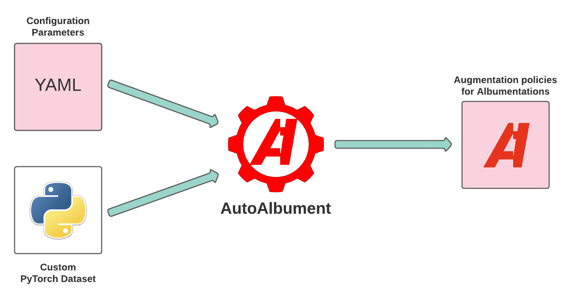

# How to use AutoAlbument



1. You need to create a configuration file with AutoAlbument parameters and a Python file that implements a custom PyTorch Dataset for your data. Next, you need to pass those files to AutoAlbument.
2. AutoAlbument will use Generative Adversarial Network to discover augmentation policies and then create a file containing those policies.
3. Finally, you can use [Albumentations](../index.md) to load augmentation policies from the file and utilize them in your computer vision pipeline.

## Step 1. Create a configuration file and a custom PyTorch Dataset for your data.

### a. Create a directory with configuration files.
 Run `autoalbument-create --config-dir </path/to/directory> --task <deep_learning_task> --num-classes <num_classes>`, e.g. `autoalbument-create --config-dir ~/experiments/autoalbument-search-cifar10 --task classification --num-classes 10`.
 - A value for the `--config-dir` option should contain a path to the directory. AutoAlbument will create this directory and put two files into it: `dataset.py` and `search.yaml` (more on them later).
  - A value for the `--task` option should contain the name of a deep learning task. Supported values are `classification` and `semantic_segmentation`.
 - A value for the `--num-classes` option should contain the number of distinct classes in the classification or segmentation dataset.

### b. Add implementation for `__len__` and `__getitem__` methods in `dataset.py`.

The `dataset.py` file created at step 1 by `autoalbument-create` contains stubs for implementing a PyTorch dataset (you can read more about creating custom PyTorch datasets [here](https://pytorch.org/tutorials/beginner/data_loading_tutorial.html)). You need to add implementation for for `__len__` and `__getitem__` methods (and optionally add the initialization logic if required).

A dataset for a classification task should return an image and a class label. A dataset for a segmentation task should return an image and an associated mask.

### c. \[Optional\] Adjust search parameters in `search.yaml`.
You may want to change the parameters that AutoAlbument will use to search for augmentation policies. To do this, you need to edit the `search.yaml` file created by `autoalbument-create` at step 1. Each configuration parameter contains a comment that describes the meaning of the setting. Please refer to the  "Tuning the search parameters" section that includes a description of the most critical parameters.

`search.yaml` is a [Hydra](https://hydra.cc/) config file. You can use all Hydra features inside it.


## Step 2. Use AutoAlbument to search for augmentation policies.

To search for augmentation policies, run `autoalbument-search --config-dir </path/to/directory>`, e.g. `autoalbument-search --config-dir ~/experiments/autoalbument-search-cifar10`. The value of `--config-dir` should be the same value that was passed to `autoalbument-create` at step 1.

`autoalbument-search` will create a directory with output files (by default the path of the directory will be `<config_dir>/outputs/<current_date>/<current_time>`, but you can customize it in search.yaml).  The `policy` subdirectory will contain JSON files with policies found at each search phase's epoch.

`autoalbument-search` is a command wrapped with the `@hydra.main` decorator from [Hydra](https://hydra.cc/). You can use all Hydra features when calling this command.

AutoAlbument uses PyTorch to search for augmentation policies. You can speed up the search by using a CUDA-capable GPU.

## Step 3. Use Albumentations to load augmentation policies and utilize them in your training pipeline.
AutoAlbument produces a JSON file that contains a configuration for an augmentation pipeline. You can load that JSON file with [Albumentations](../index.md):

```
import albumentations as A
transform = A.load("/path/to/policy.json")
```

Then you can use the created augmentation pipeline to augment the input data.

For example, to augment an image for a classification task:

```
transformed = transform(image=image)
transformed_image = transformed["image"]
```

To augment an image and a mask for a semantic segmentation task:
```
transformed = transform(image=image, mask=mask)
transformed_image = transformed["image"]
transformed_mask = transformed["mask"]
```

## Additional resources

- You can read more about the most important configuration parameters for AutoAlbument in [Tuning the search parameters](tuning_parameters.md).

- To see examples of configuration files and custom PyTorch Datasets, please refer to [Examples](examples/list.md)

- You can read more about using Albumentations for augmentation in those articles [Image augmentation for classification](../getting_started/image_augmentation.md),
[Mask augmentation for segmentation](../getting_started/mask_augmentation.md).

- Refer to [this section of the documentation](../index.md#examples-of-how-to-use-albumentations-with-different-deep-learning-frameworks) to get examples of how to use Albumentations with PyTorch and TensorFlow 2.
