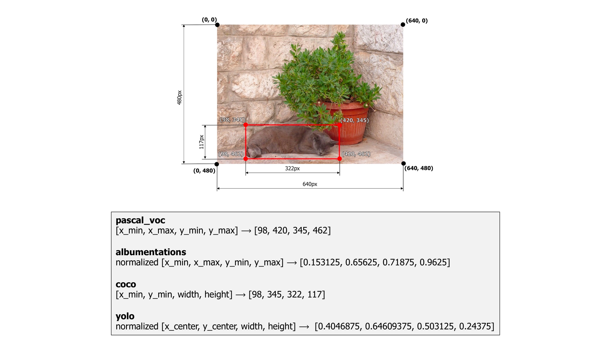
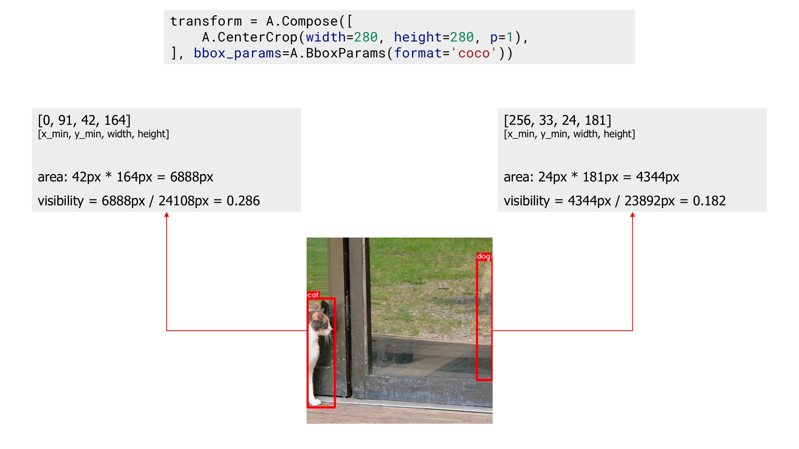
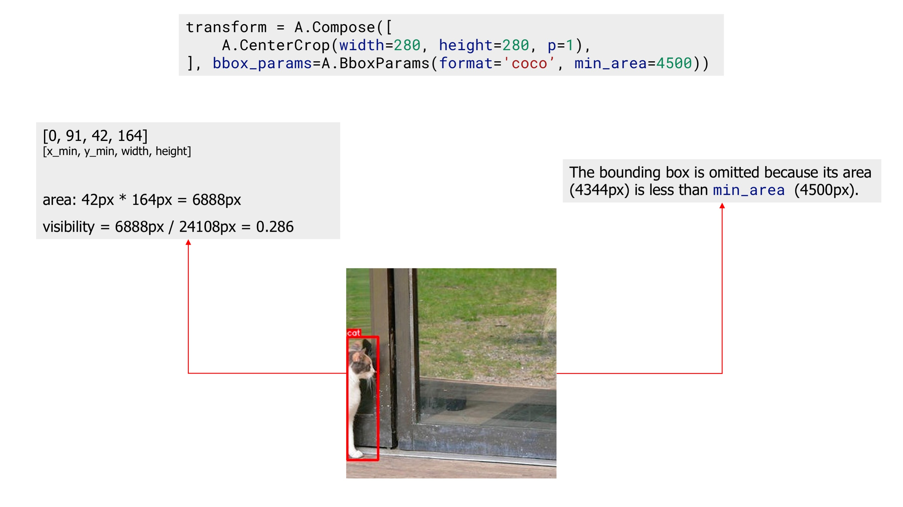

# Bounding boxes augmentation for object detection

## Different annotations formats

Bounding boxes are rectangles that mark objects on an image. There are multiple formats of bounding boxes annotations. Each format uses its specific representation of bouning boxes coordinates. Albumentations supports four formats: `pascal_voc`, `albumentations`, `coco`, and `yolo` .

Let's take a look at each of those formats and how they represent coordinates of bounding boxes.

As an example, we will use an image from the dataset named [Common Objects in Context](http://cocodataset.org/){target=_blank}. It contains one bounding box that marks a cat. The image width is 640 pixels, and its height is 480 pixels. The width of the bounding box is 322 pixels, and its height is 117 pixels.

The bounding box has the following `(x, y)` coordinates of its corners: top-left is `(x_min, y_min)` or `(98px, 345px)`, top-right is `(x_max, y_min)` or `(420px, 345px)`, bottom-left is `(x_min, y_max)` or `(98px, 462px)`, bottom-right is `(x_max, y_max)` or `(420px, 462px)`. As you see, coordinates of the bounding box's corners are calculated with respect to the top-left corner of the image which has `(x, y)` coordinates `(0, 0)`.


An example image with a bounding box from the COCO dataset
{: .image-with-caption }


### pascal_voc
`pascal_voc` is a format used by the [Pascal VOC dataset](http://host.robots.ox.ac.uk/pascal/VOC/){target=_blank}.
Coordinates of a bounding box are encoded with four values in pixels: `[x_min, y_min, x_max, y_max]`.  `x_min` and `y_min` are coordinates of the top-left corner of the bounding box. `x_max` and `y_max` are coordinates of bottom-right corner of the bounding box.

Coordinates of the example bounding box in this format are `[98, 345, 420, 462]`.

### albumentations

`albumentations` is similar to `pascal_voc`, because it also uses four values `[x_min, y_min, x_max, y_max]` to represent a bounding box. But unlike `pascal_voc`, `albumentations` uses normalized values. To normalize values, we divide coordinates in pixels for the x- and y-axis by the width and the height of the image.

Coordinates of the example bounding box in this format are `[98 / 640, 345 / 480, 420 / 640, 462 / 480]` which are `[0.153125, 0.71875, 0.65625, 0.9625]`.

Albumentations uses this format internally to work with bounding boxes and augment them.

### coco
`coco` is a format used by the [Common Objects in Context \(COCO\)](http://cocodataset.org/){target=_blank} dataset.

In `coco`, a bounding box is defined by four values in pixels `[x_min, y_min, width, height]`. They are coordinates of the top-left corner along with the width and height of the bounding box.

Coordinates of the example bounding box in this format are `[98, 345, 322, 117]`.

### yolo
In `yolo`, a bounding box is represented by four values `[x_center, y_center, width, height]`. `x_center` and `y_center` are the normalized coordinates of the center of the bounding box. To make coordinates normalized, we take pixel values of x and y, which marks the center of the bounding box on the x- and y-axis. Then we divide the value of x by the width of the image and value of y by the height of the image. `width` and `height` represent the width and the height of the bounding box. They are normalized as well.

Coordinates of the example bounding box in this format are `[((420 + 98) / 2) / 640, ((462 + 365) / 2) / 480, 322 / 640, 117 / 480]` which are `[0.4046875, 0.8614583, 0.503125, 0.24375]`.



How different formats represent coordinates of a bounding box
{: .image-with-caption }


## Bounding boxes augmentation

Just like with images and masks augmentation, the process of augmenting bounding boxes consists of 4 steps.

1. You import the required libraries.
2. You define an augmentation pipeline.
3. You read images and bounding boxes from the disk.
4. You pass an image and bounding boxes to the augmentation pipeline and receive augmented images and boxes.


## Step 1. Import the required libraries.

``` python
import albumentations as A
import cv2
```

## Step 2. Define an augmentation pipeline.

Here an example of a minimal declaration of an augmentation pipeline that works with bounding boxes.

``` python
transform = A.Compose([
    A.RandomCrop(width=450, height=450),
    A.HorizontalFlip(p=0.5),
    A.RandomBrightnessContrast(p=0.2),
], bbox_params=A.BboxParams(format='coco'))
```
Note that unlike image and masks augmentation, `Compose` now has an additional parameter `bbox_params`. You need to pass an instance of `A.BboxParams` to that argument. `A.BboxParams` specifies settings for working with bounding boxes. `format` sets the format for bounding boxes coordinates.

It can either be `pascal_voc`, `albumentations`, `coco` or `yolo`. This value is required because Albumentation needs to know the coordinates' source format for bounding boxes to apply augmentations correctly.

Besides `format`, `A.BboxParams` supports a few more settings.

Here is an example of `Compose` that shows all available settings with `A.BboxParams`:


``` python
transform = A.Compose([
    A.RandomCrop(width=450, height=450),
    A.HorizontalFlip(p=0.5),
    A.RandomBrightnessContrast(p=0.2),
], bbox_params=A.BboxParams(format='coco', min_area=1024, min_visibility=0.1, label_fields=['class_labels']))
```

### `min_area` and `min_visibility`

`min_area` and `min_visibility` parameters control what Albumentations should do to the augmented bounding boxes if their size has changed after augmentation. The size of bounding boxes could change if you apply spatial augmentations, for example, when you crop a part of an image or when you resize an image.

`min_area` is a value in pixels. If the area of a bounding box after augmentation becomes smaller than `min_area`, Albumentations will drop that box. So the returned list of augmented bounding boxes won't contain that bounding box.

`min_visibility` is a value between 0 and 1. If the ratio of the bounding box area after augmentation to `the area of the bounding box before augmentation` becomes smaller than `min_visibility`, Albumentations will drop that box. So if the augmentation process cuts the most of the bounding box, that box won't be present in the returned list of the augmented bounding boxes.


Here is an example image that contains two bounding boxes. Bounding boxes coordinates are declared using the `coco` format.


An example image with two bounding boxes
{: .image-with-caption }


First, we apply the `CenterCrop` augmentation without declaring parameters `min_area` and `min_visiiblity`. The augmented image contains two bounding boxes.


An example image with two bounding boxes after applying augmentation
{: .image-with-caption }

Next, we apply the same `CenterCrop` augmentation, but now we also use the `min_area` parameter. Now, the augmented image contains only one bounding box, because the other bounding box's area after augmentation became smaller than `min_area`, so Albumentations dropped that bounding box.


An example image with one bounding box after applying augmentation with 'min_area'
{: .image-with-caption }

Finally, we apply the `CenterCrop` augmentation with the `min_visibility`. After that augmentation, the resulting image doesn't contain any bounding box, because visibility of all bounding boxes after augmentation are below threshold set by `min_visibility`.


An example image with zero bounding boxes after applying augmentation with 'min_visibility'
{: .image-with-caption }


### Class labels for bounding boxes

Besides coordinates, each bounding box should have an associated class label that tells which object lies inside the bounding box. There are two ways to pass a label for a bounding box.

Let's say you have an example image with three objects: `dog`, `cat`, and `sports ball`. Bounding boxes coordinates in the `coco` format for those objects are `[23, 74, 295, 388]`, `[377, 294, 252, 161]`, and `[333, 421, 49, 49]`.


An example image with 3 bounding boxes from the COCO dataset
{: .image-with-caption }

#### 1. You can pass labels along with bounding boxes coordinates by adding them as additional values to the list of coordinates.

For the image above, bounding boxes with class labels will become `[23, 74, 295, 388, 'dog']`, `[377, 294, 252, 161, 'cat']`, and `[333, 421, 49, 49, 'sports ball']`.

!!! note ""
    Class labels could be of any type: integer, string, or any other Python data type. For example, integer values as class labels will look the following: `[23, 74, 295, 388, 18]`, `[377, 294, 252, 161, 17]`, and `[333, 421, 49, 49, 37].`

Also, you can use multiple class values for each bounding box, for example `[23, 74, 295, 388, 'dog', 'animal']`, `[377, 294, 252, 161, 'cat', 'animal']`, and `[333, 421, 49, 49, 'sports ball', 'item']`.

#### 2.You can pass labels for bounding boxes as a separate list.

For example, if you have three bounding boxes like `[23, 74, 295, 388]`, `[377, 294, 252, 161]`, and `[333, 421, 49, 49]` you can create a separate list with values like `['cat', 'dog', 'sports ball']`, or `[18, 17, 37]` that contains class labels for those bounding boxes. Next, you pass that list with class labels as a separate argument to the `transform` function. Albumentations needs to know the names of all those lists with class labels to join them with augmented bounding boxes correctly. Then, if a bounding box is dropped after augmentation because it is no longer visible, Albumentations will drop the class label for that box as well. Use `label_fields` parameter to set names for all arguments in `transform` that will contain label descriptions for bounding boxes (more on that in Step 4).

## Step 3. Read images and bounding boxes from the disk.

Read an image from the disk.

``` python
image = cv2.imread("/path/to/image.jpg")
image = cv2.cvtColor(image, cv2.COLOR_BGR2RGB)
```

Bounding boxes can be stored on the disk in different serialization formats: JSON, XML, YAML, CSV, etc. So the code to read bounding boxes depends on the actual format of data on the disk.

After you read the data from the disk, you need to prepare bounding boxes for Albumentations.

Albumentations expects that bounding boxes will be represented as a list of lists. Each list contains information about a single bounding box. A bounding box definition should have at list four elements that represent the coordinates of that bounding box. The actual meaning of those four values depends on the format of bounding boxes (either `pascal_voc`, `albumentations`, `coco`, or `yolo`). Besides four coordinates, each definition of a bounding box may contain one or more extra values. You can use those extra values to store additional information about the bounding box, such as a class label of the object inside the box. During augmentation, Albumentations will not process those extra values. The library will return them as is along with the updated coordinates of the augmented bounding box.

## Step 4. Pass an image and bounding boxes to the augmentation pipeline and receive augmented images and boxes.

As discussed in Step 2, there are two ways of passing class labels along with bounding boxes coordinates:

#### 1. Pass class labels along with coordinates.

So, if you have coordinates of three bounding boxes that look like this:
``` python
bboxes = [
    [23, 74, 295, 388],
    [377, 294, 252, 161],
    [333, 421, 49, 49],
]
```
you can add a class label for each bounding box as an additional element of the list along with four coordinates. So now a list with bounding boxes and their coordinates will look the following:
``` python
bboxes = [
    [23, 74, 295, 388, 'dog'],
    [377, 294, 252, 161, 'cat'],
    [333, 421, 49, 49, 'sports ball'],
]
```

or with multiple labels per each bounding box:
``` python
bboxes = [
    [23, 74, 295, 388, 'dog', 'animal'],
    [377, 294, 252, 161, 'cat', 'animal'],
    [333, 421, 49, 49, 'sports ball', 'item'],
]
```

!!! note ""
    You can use any data type for declaring class labels. It can be string, integer, or any other Python data type.

Next, you pass an image and bounding boxes for it to the `transform` function and receive the augmented image and bounding boxes.


``` python

transformed = transform(image=image, bboxes=bboxes)
transformed_image = transformed['image']
transformed_bboxes = transformed['bboxes']
```


Example input and output data for bounding boxes augmentation
{: .image-with-caption }


#### 2. Pass class labels in a separate argument to `transform`.

Let's say you have coordinates of three bounding boxes
``` python
bboxes = [
    [23, 74, 295, 388],
    [377, 294, 252, 161],
    [333, 421, 49, 49],
]
```

You can create a separate list that contains class labels for those bounding boxes:

``` python
class_labels = ['cat', 'dog', 'parrot']
```

Then you pass both bounding boxes and class labels to `transform`. Note that to pass class labels, you need to use the name of the argument that you declared in `label_fields` when creating an instance of Compose in step 2. In our cse, we set the name of the argument to `class_labels`.

``` python

transformed = transform(image=image, bboxes=bboxes, class_labels=class_labels)
transformed_image = transformed['image']
transformed_bboxes = transformed['bboxes']
transformed_class_labels = transformed['class_labels']
```


Example input and output data for bounding boxes augmentation with a separate argument for class labels
{: .image-with-caption }


Note that `label_fields` expects a list, so you can set multiple fields that contain labels for your bounding boxes. So if you declare Compose like

``` python
transform = A.Compose([
    A.RandomCrop(width=450, height=450),
    A.HorizontalFlip(p=0.5),
    A.RandomBrightnessContrast(p=0.2),
], bbox_params=A.BboxParams(format='coco', label_fields=['class_labels', 'class_category'])))
```

you can use those multiple arguments to pass info about class labels, like

``` python
class_labels = ['cat', 'dog', 'parrot']
class_category = ['animal', 'animal', 'item']

transformed = transform(image=image, bboxes=bboxes, class_labels=class_labels, class_category=class_category)
transformed_image = transformed['image']
transformed_bboxes = transformed['bboxes']
transformed_class_labels = transformed['class_labels']
transformed_class_category = transformed['class_category']
```
