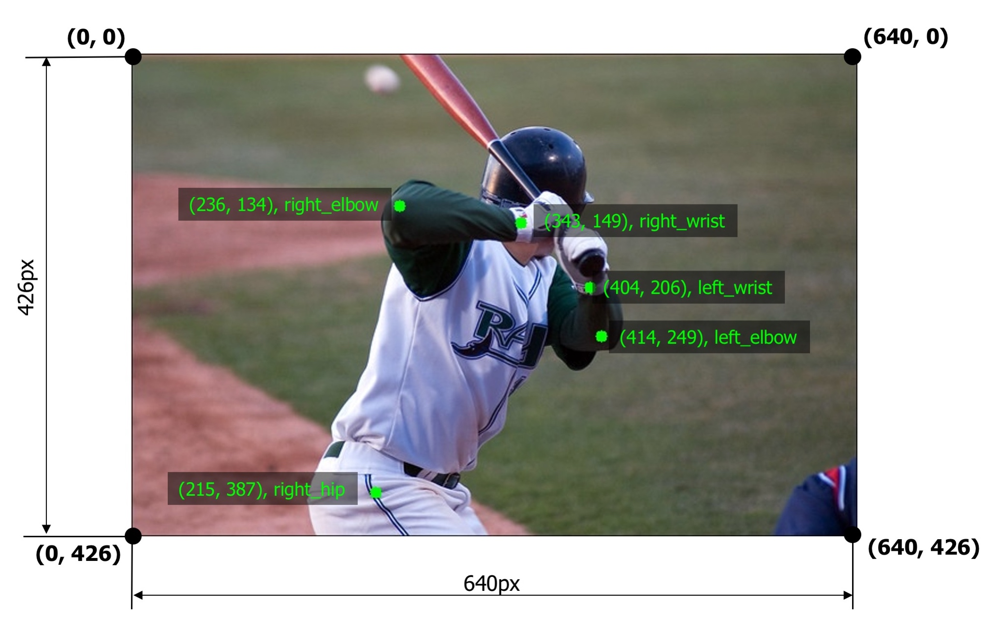

# Keypoints augmentation

Computer vision tasks such as human pose estimation, face detection, and emotion recognition usually work with keypoints on the image.

In the case of pose estimation, keypoints mark human joints such as shoulder, elbow, wrist, knee, etc.


**Keypoints annotations along with visualized edges between keypoints. Images are from the [COCO dataset](https://cocodataset.org/).**

In the case of face detection, keypoints mark important areas of the face such as eyes, nose, corners of the mouth, etc.


**Facial keypoints. Source: the "Facial Keypoints Detection" competition on [Kaggle](https://www.kaggle.com/c/facial-keypoints-detection).**


To define a keypoint, you usually need two values, x and y coordinates of the keypoint. Coordinates of the keypoint are calculated with respect to the top-left corner of the image which has `(x, y)` coordinates `(0, 0)`. Often keypoints have associated labels such as `right_elbow`, `left_wrist`, etc.



**An example image with five keypoints from the COCO dataset**

Some classical computer vision algorithms, such as SIFT, may use four values to describe a keypoint. In addition to the x and y coordinates, there are keypoint scale and keypoint angle. Albumentations support those values as well.


**A keypoint may also has associated scale and angle values**


## Supported formats for keypoints' coordinates.

- `xy`. A keypoint is defined by x and y coordinates in pixels.

- `yx`. A keypoint is defined by y and x coordinates in pixels.

- `xya`. A keypoint is defined by x and y coordinates in pixels and the angle.

- `xys`. A keypoint is defined by x and y coordinates in pixels, and the scale.

- `xyas`. A keypoint is defined by x and y coordinates in pixels, the angle, and the scale.

- `xysa`. A keypoint is defined by x and y coordinates in pixels, the scale, and the angle.


## Augmenting keypoints
The process of augmenting keypoints looks very similar to the bounding boxes augmentation. It consists of 4 steps.

1. You import the required libraries.
2. You define an augmentation pipeline.
3. You read images and keypoints from the disk.
4. You pass an image and keypoints to the augmentation pipeline and receive augmented images and keypoints.

!!! note "Note"
    Some transforms in Albumentation don't support keypoints. If you try to use them you will get an exception. Please refer to [this article](transforms_and_targets.md) to check whether a transform can augment keypoints.

## Step 1. Import the required libraries.

```python
import albumentations as A
import cv2
```

## Step 2. Define an augmentation pipeline.

Here an example of a minimal declaration of an augmentation pipeline that works with keypoints.

```python
transform = A.Compose([
    A.RandomCrop(width=330, height=330),
    A.RandomBrightnessContrast(p=0.2),
], keypoint_params=A.KeypointParams(format='xy'))
```

Note that just like with bounding boxes, `Compose` has an additional parameter that defines the format for keypoints' coordinates. In the case of keypoints, it is called `keypoint_params`. Here we pass an instance of `A.KeypointParams` that says that `xy` coordinates format should be used.

Besides `format`, `A.KeypointParams` supports a few more settings.

Here is an example of `Compose` that shows all available settings with `A.KeypointParams`

```python
transform = A.Compose([
    A.RandomCrop(width=330, height=330),
    A.RandomBrightnessContrast(p=0.2),
], keypoint_params=A.KeypointParams(format='xy', label_fields=['class_labels'], remove_invisible=True, angle_in_degrees=True))
```

### `label_fields`
In some computer vision tasks, keypoints have not only coordinates but associated labels as well. For example, in pose estimation, each keypoint has a label such as `elbow`, `knee` or `wrist`. You need to pass those labels in a separate argument (or arguments, because you can use multiple fields) to the `transform` function that will augment keypoints. `label_fields` defines names of those fields. Step 4 describes how you need to use the `transform` function.

### `remove_invisible`
After the augmentation, some keypoints may become invisible because they will be located outside of the augmented image's visible area. For example, if you crop a part of the image, all the keypoints outside of the cropped area will become invisible.
If `remove_invisible` is set to `True`, Albumentations won't return invisible keypoints. `remove_invisible` is set to `True` by default, so if you don't pass that argument, Albumentations won't return invisible keypoints.

### `angle_in_degrees`
If `angle_in_degrees` is set to `True` (this is the default value), then Albumentations expects that the angle value in formats `xya`, `xyas`, and `xysa` is defined in angles. If `angle_in_degrees` is set to `False`, Albumentations expects that the angle value is specified in radians.

This setting doesn't affect `xy` and `yx` formats, because those formats don't use angles.

## 3. Read images and keypoints from the disk.

Read an image from the disk.

```python
image = cv2.imread("/path/to/image.jpg")
image = cv2.cvtColor(image, cv2.COLOR_BGR2RGB)
```
Keypoints can be stored on the disk in different serialization formats: JSON, XML, YAML, CSV, etc. So the code to read keypoints depends on the actual format of data on the disk.

After you read the data from the disk, you need to prepare keypoints for Albumentations.

Albumentations expects that keypoint will be represented as a list of lists. Each list contains information about a single keypoint. A definition of keypoint should have two to four elements depending on the selected format of keypoints. The first two elements are x and y coordinates of a keypoint in pixels (or y and x coordinates in the `yx` format). The third and fourth elements may be the angle and the scale of keypoint if you select a format that uses those values.

## Step 4. Pass an image and keypoints to the augmentation pipeline and receive augmented images and boxes.

Let's say you have an example image with five keypoints.

A list with those five keypoints' coordinates in the `xy` format will look the following:

```python
keypoints = [
    (264, 203),
    (86, 88),
    (254, 160),
    (193, 103),
]
```
Then you pass those keypoints to the `transform` function along with the image and receive the augmented versions of image and keypoints.

```python
transformed = transform(image=image, keypoints=keypoints)
transformed_image = transformed['image']
transformed_keypoints = transformed['keypoints']
```


**The augmented image with augmented keypoints**

If you set `remove_invisible` to `False` in `keypoint_params`, then Albumentations will return all keypoints, even if they lie outside the visible area. In the example image below, you can see that the keypoint for the right hip is located outside the image, but Albumentations still retuned it. The area outside the image is highlighted in yellow.


**When `remove_invisible` is set to `False` Albumentations will return all keypoints, even those located outside the image**


If keypoints have associated class labels, you need to create a list that contains those labels:

```python
class_labels = [
    'left_elbow',
    'right_elbow',
    'left_wrist',
    'right_wrist',
    'right_hip',
]
```

Also, you need to declare the name of the argument to `transform` that will contain those labels. For declaration, you need to use the `label_fields` parameters of `A.KeypointParams`.

For example, we could use the `class_labels` name for the argument with labels.


```python
transform = A.Compose([
    A.RandomCrop(width=330, height=330),
    A.RandomBrightnessContrast(p=0.2),
], keypoint_params=A.KeypointParams(format='xy', label_fields=['class_labels']))
```


Next, you pass both keypoints' coordinates and class labels to `transform`.

```python

transformed = transform(image=image, keypoints=keypoints, class_labels=class_labels)
transformed_image = transformed['image']
transformed_keypoints = transformed['keypoints']
transformed_class_labels = transformed['class_labels']
```

Note that `label_fields` expects a list, so you can set multiple fields that contain labels for your keypoints. So if you declare Compose like

```python
transform = A.Compose([
    A.RandomCrop(width=330, height=330),
    A.RandomBrightnessContrast(p=0.2),
], keypoint_params=A.KeypointParams(format='xy', label_fields=['class_labels', 'class_sides']))
```


you can use those multiple arguments to pass info about class labels, like

```python
class_labels = [
    'left_elbow',
    'right_elbow',
    'left_wrist',
    'right_wrist',
    'right_hip',
]

class_sides = ['left', 'right', 'left', 'right', 'right']

transformed = transform(image=image, keypoints=keypoints, class_labels=class_labels, class_sides=class_sides)
transformed_class_sides = transformed['class_sides']
transformed_class_labels = transformed['class_labels']
transformed_keypoints = transformed['keypoints']
transformed_image = transformed['image']
```


**Example input and output data for keypoints augmentation with two separate arguments for class labels**

!!! note
    Some augmentations may affect class labels and make them incorrect. For example, the `HorizontalFlip` augmentation mirrors the input image. When you apply that augmentation to keypoints that mark the side of body parts (left or right), those keypoints will point to the wrong side (since `left` on the mirrored image becomes `right`). So when you are creating an augmentation pipeline look carefully which augmentations could be applied to the input data.

    
    `HorizontalFlip` may make keypoints' labels incorrect

## Examples
- [Using Albumentations to augment keypoints](../../examples/example_keypoints/)
