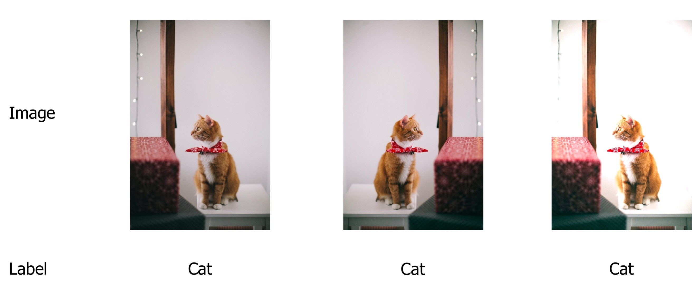
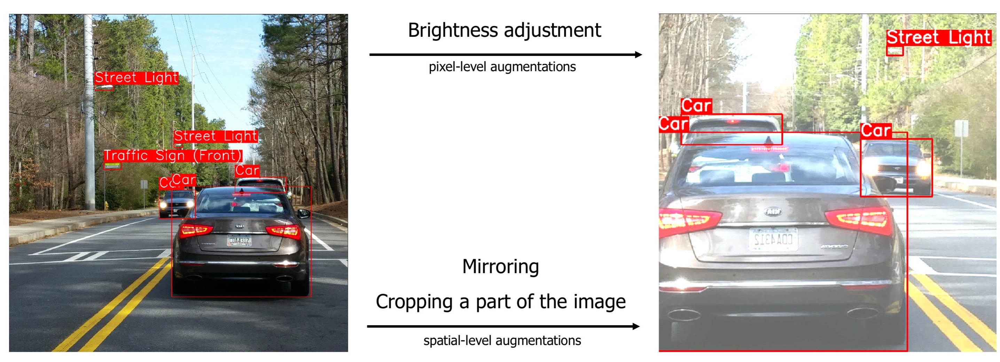

# Why you need a dedicated library for image augmentation

At first glance, image augmentations look very simple; you apply basic transformations to an image: mirroring, cropping, changing brightness and contrast, etc.

There are a lot of libraries that could do such image transformations. Here is an example of how you could use [Pillow](https://pillow.readthedocs.io/), a popular image processing library for Python, to make simple augmentations.

``` python
from PIL import Image, ImageEnhance

image = Image.open("parrot.jpg")

mirrored_image = image.transpose(Image.FLIP_LEFT_RIGHT)

rotated_image = image.rotate(45)

brightness_enhancer = ImageEnhance.Brightness(image)
brighter_image = brightness_enhancer.enhance(factor=1.5)

```


However, this approach has many limitations, and it doesn't handle all cases with image augmentation. An image augmentation library such as Albumentations gives you a lot of advantages.

Here is a list of few pitfalls that augmentation libraries can handle very well.

## The need to apply the same transform to an image and for labels for segmentation, object detection, and keypoint detection tasks.

For image classification, you need to modify only an input image and keep output labels intact because output labels are invariant to image modifications.



!!! note
    There are some exceptions to this rule. For example, an image could contain a cat and have an assigned label `cat`. During image augmentation, if you crop a part of an image that doesn't have a cat on it, then the output label `cat` becomes wrong and misleading. Usually, you deal with those situations by deciding which augmentations you could apply to a dataset without risking to have problems with incorrect labels.

    


For segmentation, you need to apply some transformations both to an input image and an output mask. You also have to use the same parameters both for the image transformation and the mask transformation.

Let's look at an example of a semantic segmentation task from Inria Aerial Image Labeling Dataset. The dataset contains aerial photos as well as masks for those photos. Each pixel of the mask is marked either as 1 if the pixel belongs to the class `building` and 0 otherwise.

There are two types of image augmentations: pixel-level augmentations and spatial-level augmentations.

Pixel-level augmentations change the values of pixels of the original image, but they don't change the output mask. Image transformations such as changing brightness or contrast of adjusting values of the RGB-palette of the image are pixel-level augmentations.


**We modify the input image by adjusting its brightness, but we keep the output mask intact.**

On the contrary, spatial-level augmentations change both the image and the mask. When you apply image transformations such as mirroring or rotation or cropping a part of the input image, you also need to apply the same transformation to the output label to preserve its correctness.


**We rotate both the input image and the output mask. We use the same set of transformations with the same parameters, both for the image and the mask.**

The same is true for object detection tasks. For pixel-level augmentations, you only need to change the input image. With spatial-level augmentations, you need to apply the same transformation not only to the image but for bounding boxes coordinates as well. After applying spatial-level augmentations, you need to update coordinates of bounding boxes to represent the correct locations of objects on the augmented image.


**Pixel-level augmentations such as brightness adjustment change only the input image but not the coordinates of bounding boxes. Spatial-level augmentations such as mirroring and cropping a part of the image change both the input image and the bounding boxes' coordinates.**


Albumentations knows how to correctly apply transformation both to the input data as well as the output labels.


## Working with probabilities
During training, you usually want to apply augmentations with a probability of less than 100% since you also need to have the original images in your training pipeline. Also, it is beneficial to be able to control the magnitude of image augmentation, how much does the augmentation change the original image. If the original dataset is large, you could apply only the basic augmentations with probability around 10-30% and with a small magnitude of changes. If the dataset is small, you need to act more aggressively with augmentations to prevent overfitting of neural networks, so you usually need to increase the probability of applying each augmentation to 40-50% and increase the magnitude of changes the augmentation makes to the image.

Image augmentation libraries allow you to set the required probabilities and the magnitude of values for each transformation.

## Declarative definition of the augmentation pipeline and unified interface

Usually, you want to apply not a single augmentation, but a set of augmentations with specific parameters such as probability and magnitude of changes. Augmentation libraries allow you to declare such a pipeline in a single place and then use it for image transformation through a unified interface. Some libraries can store and load transformation parameters to formats such as JSON, YAML, etc.

Here is an example definition of an augmentation pipeline. This pipeline will first crop a random 512px x 512px part of the input image. Then with probability 30%, it will randomly change brightness and contrast of that crop. Finally, with probability 30%, it will horizontally flip the resulting image.

``` python
import albumentations as A

transform = A.Compose([
    A.RandomCrop(512, 512),
    A.RandomBrightnessContrast(p=0.3),
    A.HorizontalFlip(p=0.5),
])
```
## Rigorous testing
A bug in the augmentation pipeline could easily go unnoticed. A buggy pipeline could silently corrupt input data. There won't be any exceptions and code failures, but the performance of trained neural networks will degrade because they received a garbage input during training. Augmentation libraries usually have large test suites that capture regressions during development. Also large user base helps to find unnoticed bugs and report them to developers.
